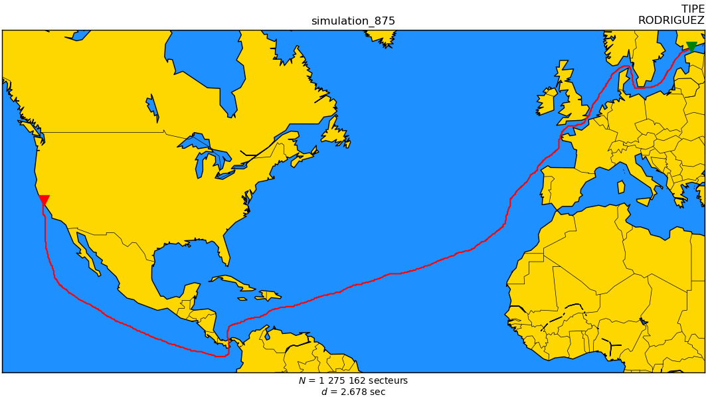

# Numeric optimization of maritime flows - Cartographic application & Theorerical prospection

## Presentation

The final report (released under slides format) is available [here](docs/slides/diapo.pdf).

### Content

- Introduction

### Results

Here are some screenshots of final results of the application developed in the third section of this project.

Other examples are avaiable in [docs/slides/img](docs/slides/img/).

|  | 
|:--:| 
| **Fig. 1** : Example of final result &bull; Simulation based on specified parameters |

## License & Author

**Lucas RODRIGUEZ** &bull;

Academic work - April 2019 - May 2020. All rights reserved